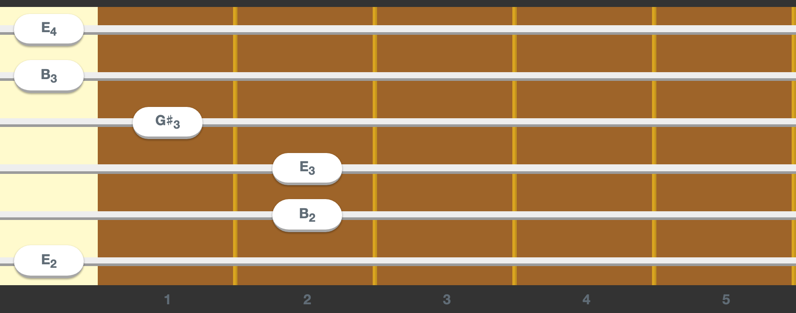

# React-Guitar &middot; [](https://www.npmjs.com/package/react-guitar)

A beautiful and accessible guitar component for React.

See https://react-guitar.com for a live demo.



[](https://codesandbox.io/s/interesting-breeze-ll7zh)

## Usage

```
npm i react-guitar
```

```jsx
import React from 'react'
import { render } from 'react-dom'
import Guitar from 'react-guitar'

render(
  <Guitar strings={[0, 1, 2, 2, 0, -1]} />,
  document.getElementById('root')
)
```

Check out [the storybook](https://react-guitar.com/storybook) for more advanced examples.

### Props

| Name           | Description                                                                                                                                                                                                                               |
| -------------- | ----------------------------------------------------------------------------------------------------------------------------------------------------------------------------------------------------------------------------------------- |
| `id`           | An optional id in case several guitars are on the screen at the same time. This is used to generate the radio button names used internally which must be unique. If not specified an autoincremented id will be generated.                |
| `className`    | A CSS class string to apply to the container element.                                                                                                                                                                                     |
| `strings`      | An array where each number represents the fret the string is pressed on (`0` means open string and `-1` muted). `[0, 1, 2, 2, 0, -1]` is an `A minor` in a standard guitar and `[3, 0, 0, 0]` is a `C major` in a ukelele.                |
| `frets`        | An object with the shape `{ from: number amount: number }` to configure the frets of the guitar (`{ from: 0, amount: 22 }` by default). It can start on any fret which is useful for displaying just a chord instead of the whole guitar. |
| `lefty`        | A boolean to configure the guitar for left handed people like me.                                                                                                                                                                         |
| `center`       | A boolean to indicate if the current fretting should be centered. If set to `true` the guitar horizontal scroll will be set so that the middle fret is centered.                                                                          |
| `renderFinger` | A function `(string: number, fret: number) => JSX.Element` that will be used to render the content of the white bubble used for the fingers. This can be used to render the note name.                                                    |
| `theme`        | A theme object to customise the guitar look and feel. See [Theming](#theming).                                                                                                                                                            |
| `playOnHover`  | A boolean to indicate if hovering with the mouse should trigger play events.                                                                                                                                                              |
| `onChange`     | A function `(strings: number[]) => void` that will be called when a string is press/unpressed. If not present the guitar will be read only.                                                                                               |
| `onPlay`       | A function `(string: number) => void` that will be called each time the user plays a string (hovering with the mouse). This can be used to play the sound of the string.                                                                  |

### Hooks

#### useSound

In order to enable sound playing `react-guitar` offers the [useSound](packages/react-guitar-sound) hook:

```
npm i react-guitar react-guitar-sound react-guitar-tunings
```

```jsx
import React, { useMemo } from 'react'
import { render } from 'react-dom'
import Guitar from 'react-guitar'
import { standard } from 'react-guitar-tunings'
import useSound from 'react-guitar-sound'

function SampleGuitarWithSound() {
  const strings = useMemo(() => [0, 1, 2, 2, 0, -1], [])
  const { play, strum } = useSound({ fretting: strings, tuning: standard })

  return <Guitar strings={strings} onPlay={play} />
}

render(<SampleGuitarWithSound />, document.getElementById('root'))
```

It receives an object with the following properties:
| Name | Description |
| -------------- | ----------------------------------------------------------------------------------------------------------------------------------------------------------------------------------------------------------------------------------------- |
| `fretting` | The same value passed as the `strings` prop to the `<Guitar />` component with the current fretting. |
| `tuning` | An array of midi values for each string. See [react-guitar-tunings](packages/react-guitar-tunings) for a list of the most common ones.|
| `instrument` | Optionally the instrument to use, an acousting nylon guitar by default.

And will return an object containing:

| Name    | Description                                                           |
| ------- | --------------------------------------------------------------------- |
| `play`  | A function that receives a string number and plays its current sound. |
| `strum` | A function that will strum all the strings of the guitar.             |

There are 2 ways to create a custom instrument:

1. Using `withSoundFont`:

   ```jsx
   import React, { useMemo } from 'react'
   import { render } from 'react-dom'
   import Guitar from 'react-guitar'
   import { standard } from 'react-guitar-tunings'
   import useSound, { withSoundFont } from 'react-guitar-sound'

   const electricGuitar = withSoundFont('electric_guitar_clean')

   function SampleGuitarWithSound() {
     const strings = useMemo(() => [0, 1, 2, 2, 0, -1], [])
     const { play, strum } = useSound({
       instrument: electricGuitar,
       fretting: strings,
       tuning: standard
     })

     return <Guitar strings={strings} onPlay={play} />
   }

   render(<SampleGuitarWithSound />, document.getElementById('root'))
   ```

   It uses [danigb/soundfont-player](https://github.com/danigb/soundfont-player) under the hood so [all these instrument names](https://github.com/danigb/soundfont-player/blob/master/names/musyngkite.json) are available.

2. Using `withSamples`:

   ```jsx
   import React, { useMemo } from 'react'
   import { render } from 'react-dom'
   import Guitar from 'react-guitar'
   import { standard } from 'react-guitar-tunings'
   import useSound, { withSamples } from 'react-guitar-sound'

   const flamencoGuitar = withSamples({
     E2: 'https://react-guitar.com/samples/E2.ogg',
     D3: 'https://react-guitar.com/samples/D3.ogg',
     G3: 'https://react-guitar.com/samples/G3.ogg',
     E4: 'https://react-guitar.com/samples/E4.ogg'
   })

   function SampleGuitarWithSound() {
     const strings = useMemo(() => [0, 1, 2, 2, 0, -1], [])
     const { play, strum } = useSound({
       instrument: flamencoGuitar,
       fretting: strings,
       tuning: standard
     })

     return <Guitar strings={strings} onPlay={play} />
   }

   render(<SampleGuitarWithSound />, document.getElementById('root'))
   ```

### Theming

`react-guitar` look and feel can be customised by passing the `theme` prop. A theme is an object describing the customisable properties of the guitar:

```tsx
{
  description: string // for screen readers
  color: string
  nut: { color: string }
  fret: {
    color: string
    separator: {
      color: string
      radius?: boolean
      shadow?: boolean
      width?: 'sm' | 'md'
    }
    marker?: (fret: number) => JSX.Element | null
    counter: { color: string }
  }
  string: { color: (string: number) => string }
  finger: { text: { color: string }; color: string }
}
```

See https://react-guitar.com/storybook/?path=/story/guitar--theming for an interactive example.

By default the guitar is styled as a Spanish guitar but some other themes are available:

- [react-guitar-theme-dark](packages/react-guitar-theme-dark): A dark theme.
- [react-guitar-theme-coco](packages/react-guitar-theme-coco): A theme for the guitar from the [Coco](<https://en.wikipedia.org/wiki/Coco_(2017_film)>) film.

## Upgrading from 0.x

If you were using `useSound` like this:

```jsx
useSound(
  {
    E2: '...E2.mp3',
    D3: '...D3.mp3',
    G3: '...G3.mp3',
    E4: '...E4.mp3'
  },
  strings,
  tuning
)
```

You need to change it to:

```jsx
import useSound, { withSamples } from 'react-guitar-sound'

// outside the render function
const instrument = withSamples({
  E2: 'https://react-guitar.com/samples/E2.ogg',
  D3: 'https://react-guitar.com/samples/D3.ogg',
  G3: 'https://react-guitar.com/samples/G3.ogg',
  E4: 'https://react-guitar.com/samples/E4.ogg'
})

// inside the render function
useSound({
  instrument,
  fretting: strings,
  tuning
})
```

## Developing

- `yarn build` will build the component and the site, this is mandatory the first time you clone the repo.
- `yarn start` will spin up the storybook and the site and all the packages in watch mode.
