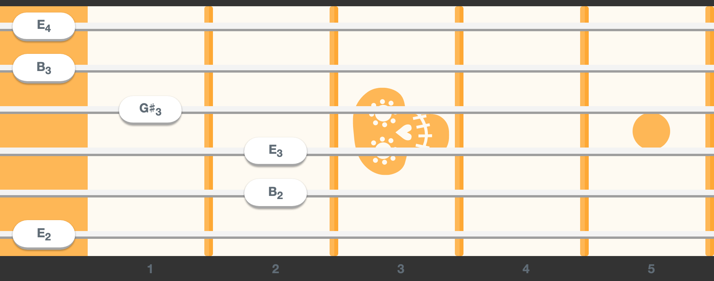

# React-Guitar Theme Coco &middot; [](https://www.npmjs.com/package/react-guitar-theme-coco)

A [react-guitar](https://github.com/4lejandrito/react-guitar) theme from the film [Coco](<https://en.wikipedia.org/wiki/Coco_(2017_film)>).

See https://react-guitar.com for a live demo.



## Usage

```
npm i react-guitar react-guitar-theme-coco
```

```jsx
import React from 'react'
import { render } from 'react-dom'
import Guitar from 'react-guitar'
import coco from 'react-guitar-theme-coco'

render(
  <Guitar strings={[0, 1, 2, 2, 0, -1]} theme={coco} />,
  document.getElementById('root')
)
```

## Developing

- `yarn start` will watch.
- `yarn build` will generate the production scripts under the `dist` folder.
