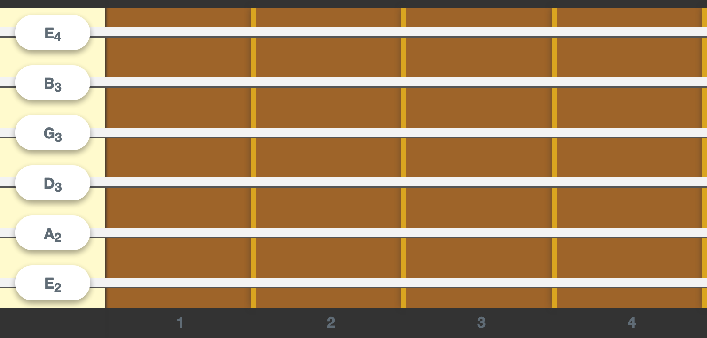

# React-Guitar &middot; [](https://www.npmjs.com/package/react-guitar)

A beautiful and accessible guitar component for React.

See https://react-guitar.com for a live demo.

**For the full documentation go to the [root README](https://github.com/4lejandrito/react-guitar).**



[](https://codesandbox.io/s/interesting-breeze-ll7zh)

## Usage

```
npm i react-guitar
```

```jsx
import React from 'react'
import { render } from 'react-dom'
import Guitar from 'react-guitar'

render(
  <Guitar strings={[0, 1, 2, 2, 0, -1]} />,
  document.getElementById('root')
)
```

Check out [the storybook](https://react-guitar.com/storybook) for more advanced examples.

## Developing

- `yarn start` will spin up the storybook.
- `yarn build` will generate the production scripts under the `dist` folder.
